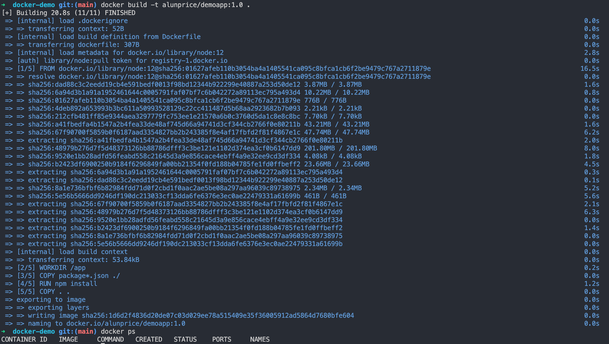
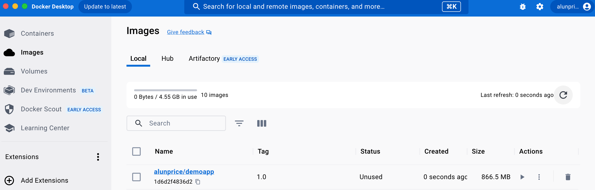
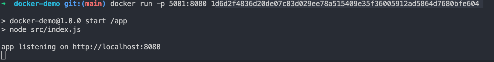
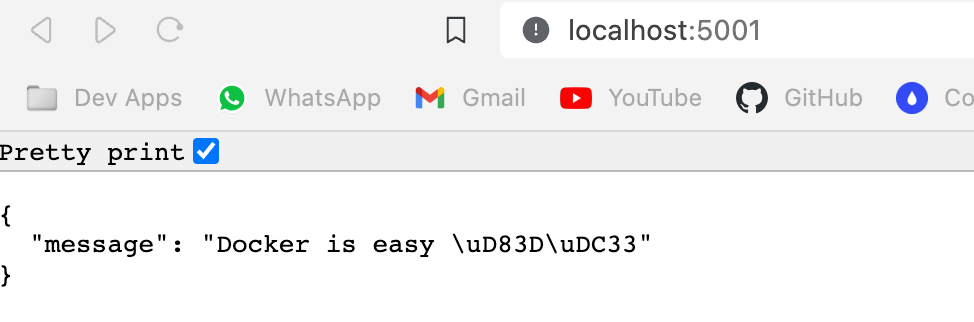
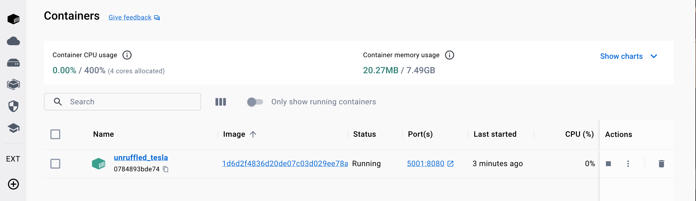
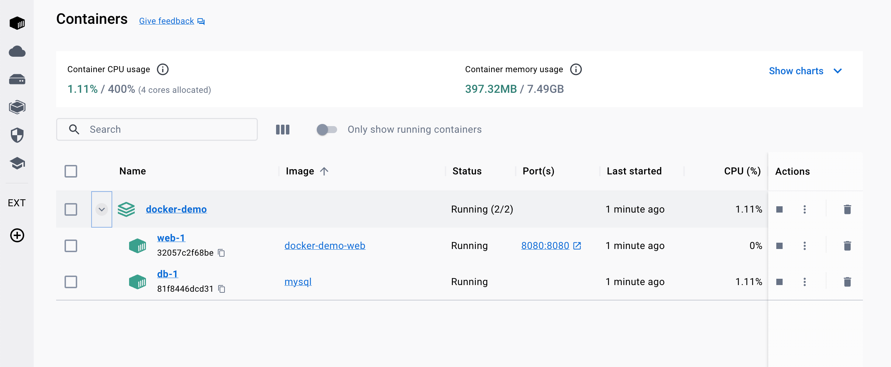

# Docker + Node.js

Dockerize a Node.js app.

Watch the full [Docker video](https://youtu.be/gAkwW2tuIqE) on YouTube or read the [Docker Tutorial](https://fireship.io/lessons/docker-basics-tutorial-nodejs/) on Fireship.io.

<iframe width="560" height="315" src="https://www.youtube.com/embed/gAkwW2tuIqE?si=l6j4-imcwhIbanSm" title="YouTube video player" frameborder="0" allow="accelerometer; autoplay; clipboard-write; encrypted-media; gyroscope; picture-in-picture; web-share" allowfullscreen></iframe>

- What is Docker?

  - a way to package software so that it can run on any hardware (practical approach)

- To Understand how Docker works, there are 3 things that you must know

  - Dockerfile
    - blueprint for building a docker image
  - Images
    - template for running a docker container
  - Containers
    - its just a running process

- Example : Node Application

  - it could run fine on our machine as we developed it with all the right dependencies
  - but what if somebody else tries to run it on their machine with a different set of dependencies or on a server that's running a different version of node??
  - whole point of docker is to solve problems like this by "reproducing environments"!!
  - the developer who creates the software can write the **dockerfile**
  - this allows any dev to use the **dockerfile** to "recreate the environment"
  - saved as an immutable snapshot known as an **image**
  - images can be uploaded to the cloud to both public and private registries
  - a dev or server that wants to run that software can pull down an image to create a container (a running process of that image)
  - single image - can be used to spawn the process multiple times and in multiple places
  - at that point, tools like Kubernetes and Swarm come into play to scale containers to an infinite workload

- Installing and Tooling
  - best way to learn Docker is to use it
  - Install
    - on Mac or Windows, installing Docker Desktop is recommended
    - installs everything you need for command line and gives you a GUI for inspecting containers
    - docker ps - list of running containers
    - should also install the docker ext for vscode if you're using it
  - My Setup
    - docker-demo in workspaces
    - downloaded zip file from docker https://github.com/fireship-io/docker-nodejs-basic-demo
    - copied code to docker-demo dir and opened that folder in vscode
    - git init and set up github repo docker-demo

**src/index.js**

```js
const app = require("express")();

// exposes an API endpoint that sends back the message docker is easy
app.get("/", (req, res) => res.json({ message: "Docker is easy 🐳" }));

// expose our app using the port environment variable
const port = process.env.PORT || 8080;

app.listen(port, () =>
  console.log(`app listening on http://localhost:${port}`)
);
```

To dockerise an app, you start by building out the Dockerfile ...

- The Dockerfile - contains code to build your image and run your app - each instruction step is considered to be a layer and docker will cache a layer if nothing changes in it!! - FROM - if I write FROM ubuntu and ctrl-click ubuntu, it will take you to all the base images there are for ubuntu - hovering over FROM, will tell you what it does - it sets the baseimage and must be the first instruction in the dockerfile - we'll use the officially-supported Node.js image = node:12 - WORKDIR - add our app source code to the image - this instruction is kinda like when you cd into a dir - Set the working directory for any subsequent ADD, COPY, CMD, ENTRYPOINT, or RUN instructions that follow it in the Dockerfile. - COPY - normally we get our source code first and then add the dependencies - with docker it's the other way around - here we'll want to copy the dependencies/node_modules and Docker will cache them so we don't need to constantly reload them every time the src code changes - the instruction takes 2 args = where the local package.json is and where we want to copy it to - copies package.json and package-lock.json to container's current working dir - RUN - like opening the terminal and running a command - results will be added as a layer - Execute any commands on top of the current image as a new layer and commit the results. - npm install will install our modules - COPY - copy over our local src files to our container dir - copy files or folders from source to the dest path in the image's filesystem. - creates a problem here - we have a node_modules dir that will be copied and over-ride the modules that we've just installed there - solution = add a dockerignore file to the local - ENV - Set the environment variable key to the value value - set the port=8080 - EXPOSE - Define the network ports that this container will listen on at runtime (8080) - CMD - Provide defaults for an executing container. If an executable is not specified, then ENTRYPOINT must be specified as well. - There can only be one CMD instruction in a Dockerfile - \["npm", "start"] = EXEC FORM = array of strings - doesn't start up a shell session; unlike in RUN npm install = SHELL FORM
  **Dockerfile**

```
FROM node:12

WORKDIR /app

COPY package*.json ./

RUN npm install

COPY . .

ENV PORT=8080

EXPOSE 8080

CMD [ "npm", "start" ]
```

THE IMAGE

- How do we build a docker image??
- docker build -t \<docker username>/\<image name> .
- -t stands for tag
- . stands for copying to the current working file (make sure you're there when running the command)
- docker build -t alunprice/demoapp:1.0 .





- we've created the image alunprice/demoapp and it shows up in images on docker desktop
- now we can use this image as a base image or run a container (note : docker ps shows no running container and there are no containers running in desktop at the minute either!)
- in real life, to use the image, you'll most likely push it to a registry somewhere
- dockerhub or your favourite cloud provider
- use **docker push** to do that (**docker pull** allows devs to use it!)

THE CONTAINER

- we just want to run the container on our local system
- use the docker run command (there's also a run button in docker desktop)
- we can supply it with the image id or the tag name
- Example:
- docker run d6d2f4836d20de07c03d029ee78a515409e35f36005912ad5864d7680bfe604
  - says running container on 8080
  - if we go to that address in browser, we don't see anything??
  - we need to implement **port forwarding** from docker to our local machine!!!
  - to do this, we use a -p 5001:8080 in the docker run command
  - now if we go to port 5001 in our browser, we'll see our message ..





**Note:** this shows up in our Docker Desktop too and we can use the GUI to easily close down the container (it will continue to run even after we close the terminal) and stop it running.



**NOTE:** when you stop the container, any STATE or data that you created inside of it will be LOST!!!!!!!!

There can be situations where you want to share data across multiple containers!!!

The preferred way to do that is with VOLUMES

VOLUMES

- Volume = dedicated folder on the host machine
- Inside the volume, a container can create files that can be remounted into future containers or multiple containers at the same time
- to create a volume, use **docker volume create \<volume name>**
- docker volume create shared-stuff
- multiple containers can access the volume files and the files stick around after the containers are shut down
- --mount source=shared-stuff, target=/stuff

DEBUGGING

- use Docker Desktop - click on running container - shows logs - can access command line from here
- can use ls, (docker exec command)
- TIP: 1 process per container (best way to keep them healthy)
- if App needs multiple processes, then you should use multiple containers

DOCKER COMPOSE

- tool for running multiple containers at the same time!!!!
- lets imaging our node app wants to connect to a MySQL database
- manage using docker-compose.yml in root of project

**docker-compose.yml**

```yaml
version: "3"
services:
  web:
    build: .
    ports:
      - "8080:8080"
  db:
    image: "mysql"
    environment:
      MYSQL_ROOT_PASSWORD: password
    volumes:
      - db-data:/foo

volumes:
  db-data:
```

- now that we have the docker-compose.yml set, we can use the following command to run it all;
- **docker-compose up**
- this will find the file and run all the containers together



- run docker-compose down to close all the containers together!!

  - Command Line Commands
    - docker ps = shows running containers
    - docker build -t alunprice/demoapp:1.0 .
    - docker push
    - docker pull
    - docker run -p 5001:8080 \<tag-name>
    - docker-compose up
    - docker-compose down
